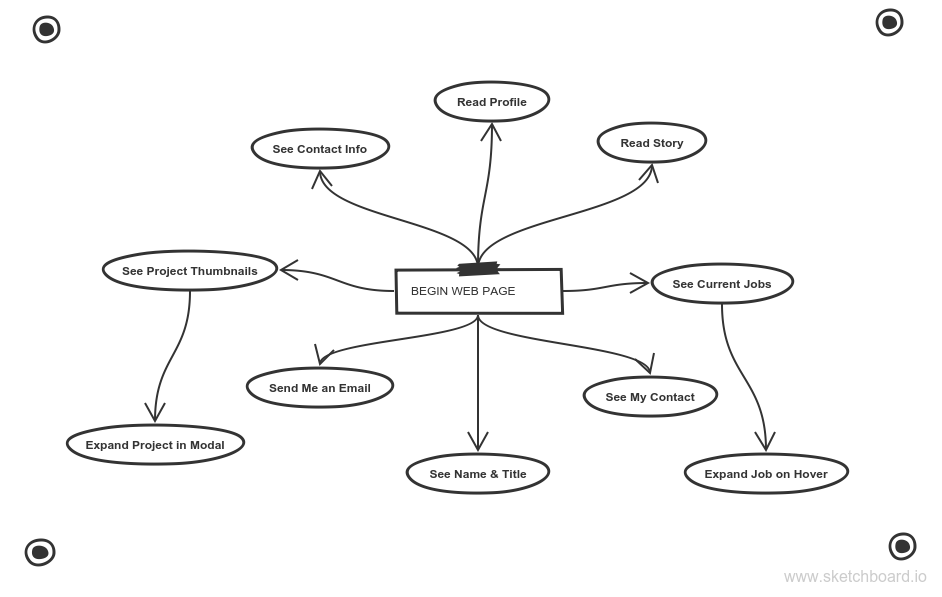

# User-Centered Portfolio

This website is a web portfolio.  It exists so employers and other developers can learn a little about me and see some of my work.

(This project is featured in [Scotch.io's Materialize tutorial](https://scotch.io/tutorials/make-material-design-websites-with-the-materialize-css-framework).)

### Index:
* [User Stories](#user-stories)
* [Story Dependencies](#story-dependencies)
* [Dev Schedule](#dev-schedule)
* [Wireframe](https://wireframe.cc/wPUR6v)
* [Notes](#notes)

---

## User Stories

A user will come to my website to learn about me.  They can read my story and see what I'm working on now.  Users can also see a spread of my featured projects.  Each project sample can be expanded into a modal window.  Finally, a user can see my contact information or send me an email directly from this page.

In no particular order, a user can ...
* See my name and title
* Read about my experience
* Hover over a current job for more info
* Read my story
* Read my profile
* See my current jobs
* Click a project thumbnail to see more detail
* See thumbnails of my portfolio projects
* Send me an email
* See my contact info

[TOP](#index)

---

## Story Dependencies

Here is a tree that orders the user stories by dependence.  ie. Before a user can click on a thumbnail, there must be able to see it.

[TOP](#index)

---

## Development Schedule

I'll develop the features in this order, respecting their dependencies (ie. not trying to make a modal before the thumbnail):
0. Get everything set up
1. Name & Title
2. Read story
3. Read profile
4. See current jobs
5. Expand jobs on hover
6. See project thumbnails
7. Expand projects in modal
8. Send me an email
9. See my contact

[TOP](#index)

---

## Notes

Things I learned:
* Monkey testing
* User stories
* Materialize classes
* Live-Reloader

New vocab words:
* Transpiler
* Design Thinking

Struggles I had:
* Building my dependency tree
* Setting up Gremlins.js
* Expanding jobs on hover

Plans for improving:
* Work on configuring Gremlins.js
* Keep track of remote and local changes
* Thinking in user stories
* Practice ordering my study by dependency

[TOP](#index)

___
___
### 
